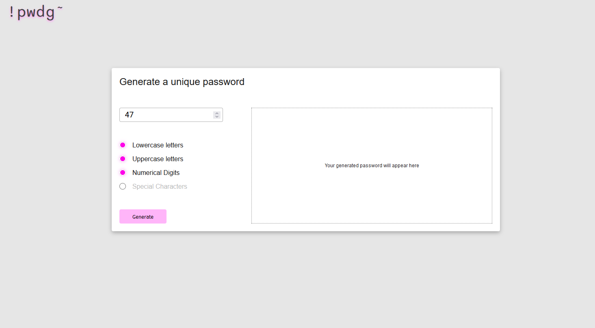

# !pwdg~ | Password Generator

<br/>
<br/>

## Libaries used

- No external libraries were used in this project
  <br/>
  <br/>

## Core Functionality

- Generates a randomized password with a set of parameters that are selected from the user
  <br/>
  <br/>

## An inside look

#### \* **READ** — Before we get started on this section I would just like to express that this is way more code than I needed to write to build this simple password generator. However, the reason I took so many extra steps was to be able to practice prototypes, object methods and mainly to practice javascript proxies.

### **The Password class**

#### You will find this class in the `Password.js` file. It makes up all of the functionaliy to generate a randomized password

<br/>

#### 1. The `Password` instance takes two parameters `trueOptions` which needs be an array, there is no error handling on this but it won't work if it's not an array and `length` which is going to be only a number.

#### 2. Then we have two internal properties, `allOptions` which is an object of the different options a user can use in their password and `errors` which is initially set to `null` until later told otherwise.

<br/>

```
class Password{
    constructor(trueOptions,length){
        this.trueOptions = trueOptions;
        this.length = length;
        this.allOptions = {
            lowers: "abcdefghijklmnopqrstuvwxyz",
            uppers: "abcdefghijklmnopqrstuvwxyz".toUpperCase(),
            numeric: "0123456789",
            specials: `~!@#$%^&*()_+=}{[]|/\\?'",.<>`,
        };
        this.errors = null;
    }
}
```

<br/>
<br/>

#### 3. With the class `Password`, we have two methods `generate` and `randomize`. Let's talk about `generate`

#### 4. The `generate` method maps through all of the items in `trueOptions` as `option` and accesses the properties in `allOptions` that correspond with each `option` then calls `.join("")` on the array to turn it into one whole string.

#### 5. We then set a variable `genPassword` to and empty array for later use

#### 6. The `formError` function is used to set the `this.errors` to an object with a property of `errMsg`. When this happens `this.errors` will no longer be `null`

<br/>

```
generate(){
  let trueOptionValues = this.trueOptions.map((option) => this.allOptions[option]).join("");
  let genPassword = []
  const formError = (msg) =>{
    this.errors = { errMsg: msg };
    return this.errors;
  }
}

```

<br/>
<br/>

#### 7. Now lets see the conditionals in action. These a very self explanatory if you've worked with javascript so I'm not going to go into detail but there is one thing that I want to point out.

#### 8. Notice how I can call `.isEmpty()` on the `trueOptions` array, this is because I set a method on `Array.prototype` so that arrays can check itself for occupancy. Check the file `./lib/prototypes.js` for more info

#### 9. Then we just check that length is less than 8 and greater than 128

#### 10. If everything passes then we set `this.errors = null` then loop until we reach the specified `length` number. Pushing a random character to the `genPassword` array with each loop using the `this.randomize` method to randomize the characters being pushed.

<br/>

```
generate(){
  let trueOptionValues = this.trueOptions.map((option) => this.allOptions[option]).join("");
  let genPassword = []
  const formError = (msg) =>{
    this.errors = { errMsg: msg };
    return this.errors;
  }
  if (this.trueOptions.isEmpty()){
        return formError("Please select at least one option");
  }
  if (this.length < 8) {
      return formError("Length should be greater than 8 and an integer");
    } else if (this.length > 128) {
      return formError("Length should be less than 128");
    } else {
      this.errors = null;
      for (let i = 0; i <= this.length - 1; i++) {
        genPassword.push(this.radomize(trueOptionValues));
      }
      return genPassword.join("");
    }


}
```

<br/>
<br/>

#### 11. The `randomize` method is a simple method inside the `Password` class and is only used in the class itself.

<br/>

```
radomize(string) {
    return string.split("")[Math.floor(Math.random() * string.length)];
  }
```

<br/>

### **The query function**

#### #DISCLAIMER — This only works on one DOM element at a time because I am only using `querySelector()` and not allowing for both `querySelector()` and `querySelectorAll()`.

#### In my code you will see this function named `query`. You can find out how this function was built in `./js/lib/DomHelper.js` I've learned about javscript proxies and it has been very interesting to me so I thought I would use it in this app, I will give a small example of how it is used in this project, take a look!

<br/>

#### 1. We create the `query` function with a parameter named `element` where we will pass in a class, id, or tag of an element. Inside the function, we select that element with `querySelector` setting it to `el`

#### 2. We create a variable named `queryProxy` setting it to a new `Proxy`. In this proxy we pass in two parameters which are both objects

#### 3. The first parameter is known as our target and will be the `el` object that we get from `querySelector`

#### 4. The second parmeter is for our `set` and `get` functionality. Which is an object as well, also know as our handler.

<br/>

```

const query = (element) => {
    const el = document.querySelector(element)
    let queryProxy = new Proxy(el,{})
}

```

<br/>
<br/>

#### 3. As you can see, our `get` property has a function that passes `obj`, `prop`, and a `reciever` in the parameters

#### 4. Our `set` property has a function that passes `obj`, `prop`, and a `value` in the parameters

<br/>

```

const query = (element) => {
    const el = document.querySelector(element)
    let queryProxy = new Proxy(el,{
        get:(obj,prop,reciever)=>{},
        set:(obj,prop,value)=>{}
    })
}

```

<br/>
<br/>

#### 5. We now start adding the logic to our `get`:

 <br/>

```

const query = (element) => {
    const el = document.querySelector(element)
    let queryProxy = new Proxy(el,{
        get:(obj,prop,reciever)=>{
            if(prop === 'click'){
                obj[prop] = (event) => {
                    el.addEventListener(prop,event)
                }
            }
        return Reflect.get(obj,prop)
        },
        set:(obj,prop,value)=>{}
    })
    return queryProxy
}

```

#### 6. We are checking if `prop` === `click`

##### Example of how `prop` would equal `click`:

```

query('.box').click

```

#### 7. if `prop` === `click` then it returns a function that we can pass a parameter of an event callback. Then add an event listener to the current element, example use:

##### Example

```

query('.box').click( (e) => console.log(e.target) )

```

#### 8. Then we return `Reflect.get(obj,prop)`, this is like property accessor stynax but as a function as stated [here](https://developer.mozilla.org/en-US/docs/Web/JavaScript/Reference/Global_Objects/Reflect/get).

##### Example of how `Reflect.get(obj,prop)` would be used:

```

// if we had an object called myNewObject

const myNewObject = {
name:"exampleName",
type:"exampleType"
}

Reflect.get(myNewObject,'name')

//expected output => 'exampleName'

```

#### 9. After the logic is done we now return `queryProxy`

### Overview

- #### Again, this is probably alot more code than it needed to be but I just wanted to test out proxies mainly!
- #### I didn't go over the `set` property because I didn't use it in this project but if you are curious here is link that goes in detail [MDN handler.set()](https://developer.mozilla.org/en-US/docs/Web/JavaScript/Reference/Global_Objects/Proxy/Proxy/set)

- #### Overall I had fun creating this function to help me with my DOM manipulation in this app. I was able to learn more about how a javascript proxy is used and what it can do. I just know that there is so much more that can be done with a javascript proxy and can't wait to learn more

### Bugs

- If you create an error or create password successfully you will generate a toast notification. The toast disappears after 4 seconds and if you generated another toast 2 seconds after the original toast then the second toast will disappear within 2 seconds.

### This app is responsive to mobile.

[Link to live demo](https://641c05caa283f17c09d39d3e--pwdg-jimenez2society.netlify.app)

## Here is a quick look at the UI of this app:


